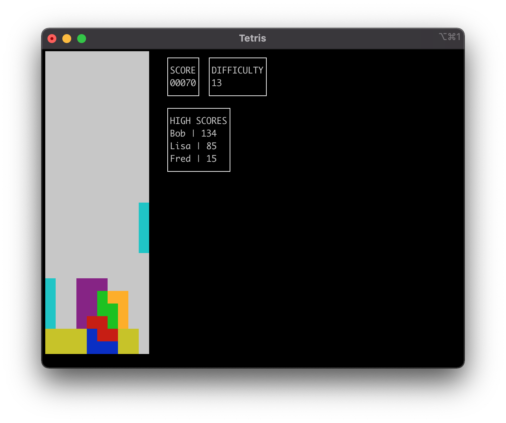

# Tetris (Node + TypeScript)
A basic terminal-based implementation of Tetris.

## Features
- Written in TypeScript and executed with node.
- Rendering done within the terminal using [blessed](https://github.com/chjj/blessed).
- High scores recorded in a local PostgreSQL database.

## Setup

1. Clone repo.
2. Open repo directory.
3. ```npm install -g .```
4. Install PostgreSQL.
    - ```brew install postgresql``` (Mac OS X)
    - Assumes a default "postgres" database exists, used to create the client connection.

## Usage
```sh
tetris -h

Options:
      --version     Show version number                                [boolean]
  -d, --difficulty  How fast the pieces move down.         [number] [default: 0]
  -h, --help        Show help                                          [boolean]
```

## Screenshots

